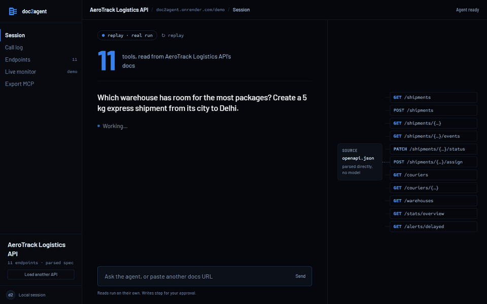
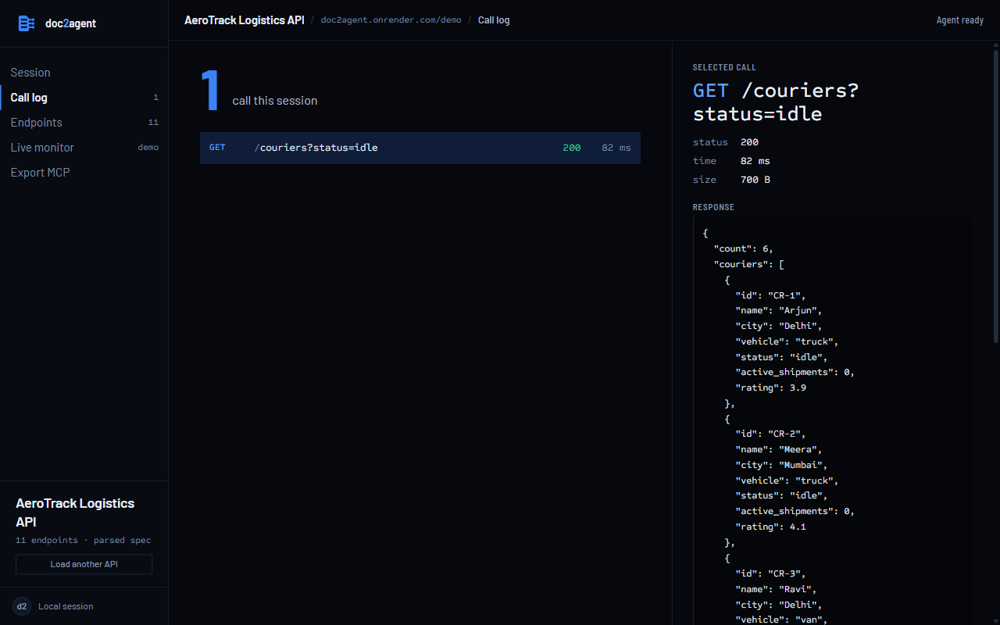
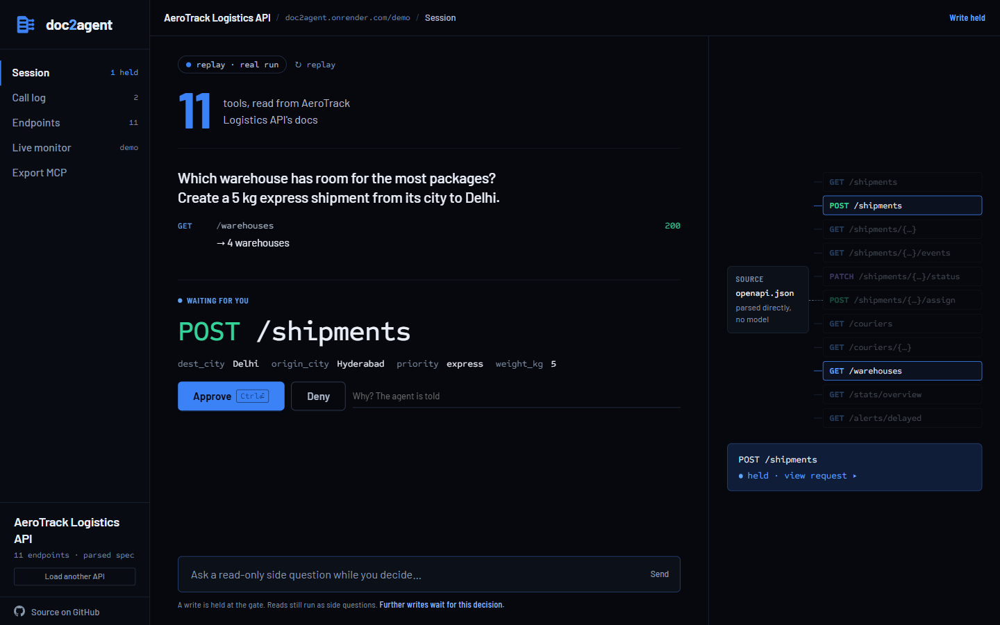
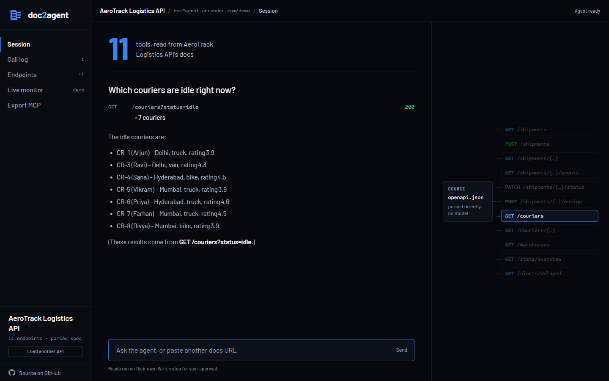
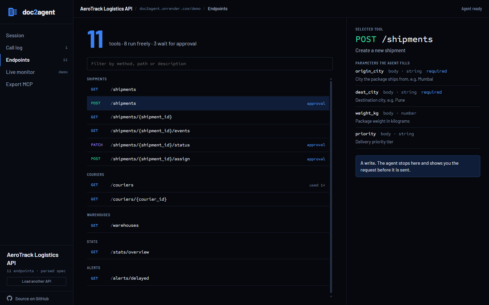
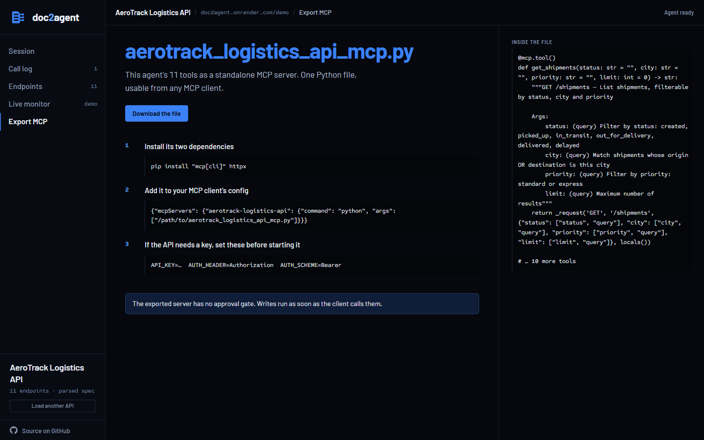
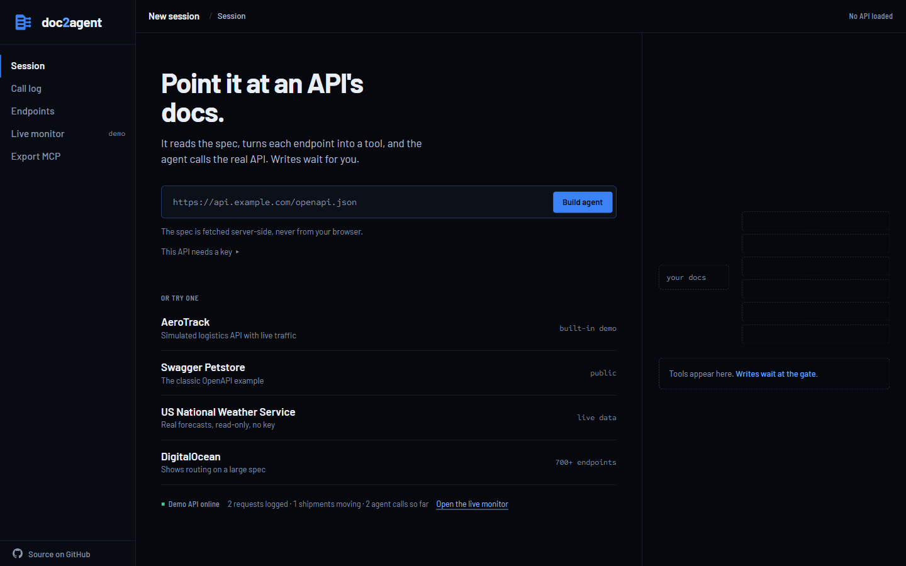
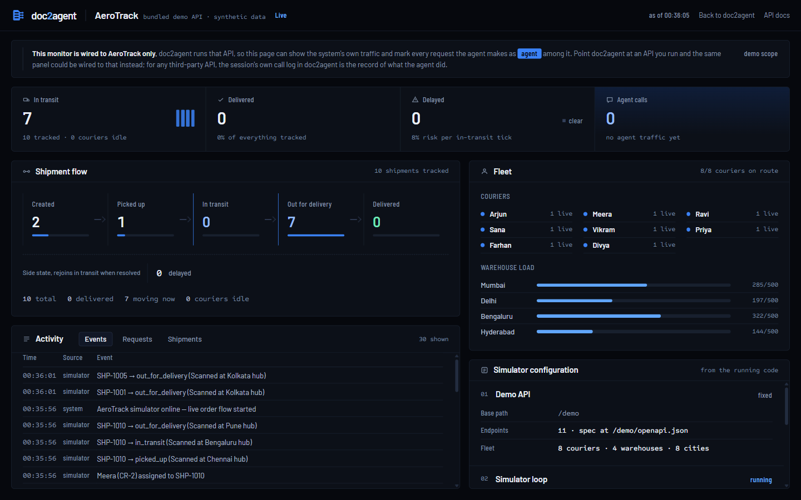
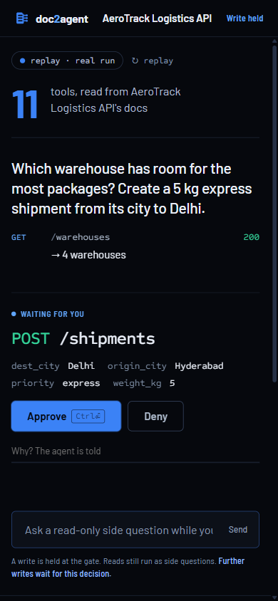
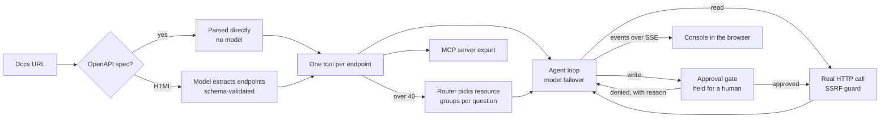

# doc2agent

[](https://github.com/VamP08/doc2agent/actions/workflows/ci.yml) [](LICENSE)

Point it at a REST API's documentation and it builds a working AI agent for that API on the spot. The agent makes real HTTP calls, shows every request it makes, and asks before it writes anything.

Live demo: **[doc2agent.onrender.com](https://doc2agent.onrender.com)** (free hosting, so the first load after idle takes about a minute). There's a built-in demo API to try it against, and a live monitor at [/monitor](https://doc2agent.onrender.com/monitor) where you can watch the agent's calls land among that API's own traffic.



## What it does

Most tool-calling demos ship with tools someone wrote by hand. Here the tools don't exist until runtime:

1. Give it a docs URL. If the URL serves an OpenAPI/Swagger spec, it's parsed directly with no LLM involved. If it's an HTML docs page, the text gets scraped and an LLM extracts the endpoints into a strict schema (validated, invalid entries dropped).
2. Each endpoint becomes a tool-calling schema and a chat agent gets wired to them.
3. Ask a question. The agent chains real HTTP calls, retries on errors, and every request appears in the UI with its status code.



<details>
<summary>More screens</summary>

| | |
|---|---|
|  |  |
|  |  |
|  |  |



</details>

Beyond the core loop:

- Write operations (POST/PUT/PATCH/DELETE) pause the agent at an approval gate. The held write shows its method, resolved path and the arguments it will send, and one click opens the request exactly as it will go out, headers and JSON body included. You approve (Ctrl/Cmd+Enter), deny (optionally with a reason the agent is told), or turn on auto-approve for the session.
- While a write is held you can still ask read-only side questions; they run as an isolated turn so the held conversation is never touched.
- Tool calls stream to the UI over SSE as they happen, including routing decisions and approval prompts.
- The site opens on a replay of one recorded AeroTrack run, labelled as a replay, which stops at the approval gate. Approve or Deny plays the recorded outcome. Your first click in the input switches to a live session. The recording is made by `scripts/capture_replay.py` against a running server.
- Large APIs get routed: endpoints are clustered by the first path segment that names a resource, and a small model picks the relevant clusters per question, so a 600-endpoint API doesn't blow the context budget.
- Sessions persist in SQLite, so conversations survive restarts.
- Any ingested API can be exported as a standalone MCP server file, usable from Claude Desktop or Cursor. The export covers the first 40 endpoints and has no approval gate of its own; the page that offers it says both.
- SSRF protection: every hostname must resolve to a public IP or the request is refused.

## How it works



## Why this instead of…

- **Hand-written tools.** The usual tool-calling demo wires a model to functions someone wrote for one API. Here nothing exists until the docs are read, so the same app works against an API it has never seen.
- **An OpenAPI-to-MCP generator.** If you already have a spec and only want an MCP server, a generator is the simpler tool, and doc2agent can export one too. What it adds is the run itself: the agent calling the API in front of you, every request visible, writes held for a person, large specs routed, and HTML docs handled when there is no spec at all.

## Design decisions

- **Parse first, model second.** An OpenAPI spec is parsed without a model, so the common case is deterministic and free. The model only sees docs that have no spec.
- **Route by resource, round-robin.** A large spec is grouped by the first path segment that names a resource, a small model picks up to three groups per question, and tools are drawn from those groups in turn. Concatenating the groups instead let one 119-endpoint group take the whole 40-tool budget.
- **The gate holds the thread.** A write waits on the server for a decision. A timeout counts as a denial, so an abandoned approval fails safe instead of running.
- **The opening replay is recorded, not scripted.** `static/replay.json` is a real run captured by `scripts/capture_replay.py` and played back through the same renderer the live session uses, so the first screen shows the product's real output.
- **Budgets are per model.** On the free tier each model has its own daily token budget, so a model that runs out is skipped until Groq says it has budget again, and a per-minute limit is waited out rather than failing the turn.

## Known limitations

- Docs rendered by JavaScript can't be read; use the spec URL. From HTML docs, only the first 42,000 characters are sent to the model.
- Authentication is a single header (an API key or a bearer token). There are no OAuth flows.
- At most 40 tools reach the model per question. Within a routed group, tools are taken in spec order, so a relevant endpoint far down a large group can be missed.
- Each tool response is cut to 8,000 characters before the model sees it, and an answer is capped at 8 rounds of tool calls.
- The live demo runs on Groq's free tier: when the main model's daily budget is spent, answers come from a smaller model, and each visitor can ask 20 questions every 10 minutes.
- A held write waits up to 180 seconds for a decision, then counts as denied.
- The MCP export covers the first 40 endpoints and has no approval gate of its own.
- Sessions and the AeroTrack demo data reset on every redeploy. Rate limits and model cooldowns live in one process.

## The built-in demo

The app ships with AeroTrack, a simulated logistics API (shipments, couriers, warehouses) with a background simulator that keeps orders flowing. Its OpenAPI spec is auto-generated, so it doubles as the test case for the deterministic ingestion path. Swagger docs are at `/demo/docs`.

The demo worth doing: open `/monitor` in one window and the app in another, click into the app's input to start a live AeroTrack session, then ask:

> Create a new express shipment of 5 kg from Mumbai to Pune, find an idle courier, and assign them to it.

Each write stops at the gate. The monitor shows the shipment moving through the fleet while it happens, and every request the agent makes is tagged `agent` in its activity log, among the simulator's own. The monitor is wired to AeroTrack only, because that is the one API doc2agent runs; for any other API, the session's call log is the record of what the agent did.

## Running locally

```bash
git clone https://github.com/VamP08/doc2agent && cd doc2agent
conda create -n doc2agent python=3.12 -y
conda activate doc2agent
pip install -r requirements.txt
cp .env.example .env    # put a free key from console.groq.com in here
uvicorn app.main:app --reload
```

Open http://127.0.0.1:8000. Public APIs that work well:

| URL | Ask |
|---|---|
| `https://petstore3.swagger.io/api/v3/openapi.json` | "Find the available pets and summarise them" |
| `https://api.weather.gov/openapi.json` | "What's the forecast for latitude 39.74, longitude -104.99?" |

Note: docs sites that render via JavaScript can't be scraped. Use the API's spec URL instead (often at `/openapi.json`).

## Tests and evals

```bash
pytest evals -q               # 75 offline tests, no API key needed
pytest smoke -q               # 5 browser smoke tests in Chromium (python -m playwright install chromium first)
python -m evals.agent_evals   # live tasks against a running server
```

The offline suite covers spec parsing against a pinned Petstore snapshot, the SSRF guard, the demo API contracts, tool synthesis, MCP export validity, session serialization, model failover, approval-denial handling, and routing against DigitalOcean's 659-endpoint path list. The live evals run scripted tasks and verify the outcome against the actual data store rather than trusting the agent's reply; results go to `evals/scorecard.md`. CI runs the offline suite on every push, and the live evals too if a `GROQ_API_KEY` secret is configured.

## Deploying

The Dockerfile listens on `$PORT` if the host sets it, otherwise 7860. Currently running on Render's free tier: connect the repo, pick the Docker runtime, set `GROQ_API_KEY` in the environment, done. Sessions and demo data are demo-scale by design and reset on redeploy.

## Stack

FastAPI, Groq (gpt-oss-120b, with failover across model candidates), httpx, BeautifulSoup, Pydantic, SQLite, vanilla JS. No frontend framework. MIT licensed.
